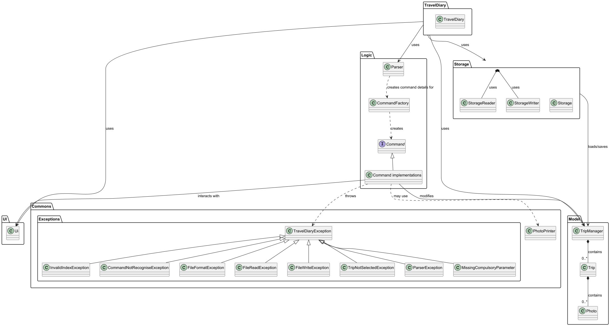
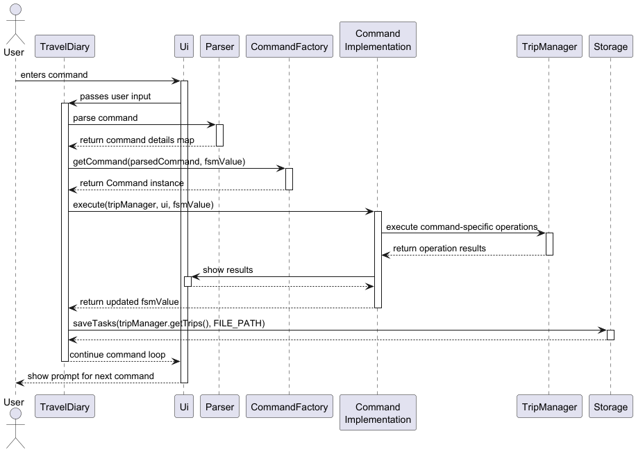
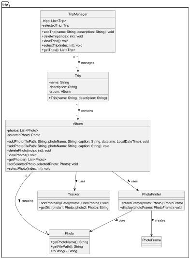
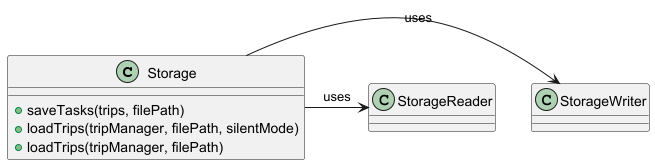
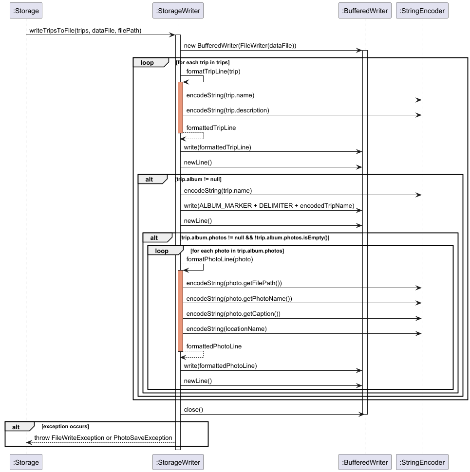
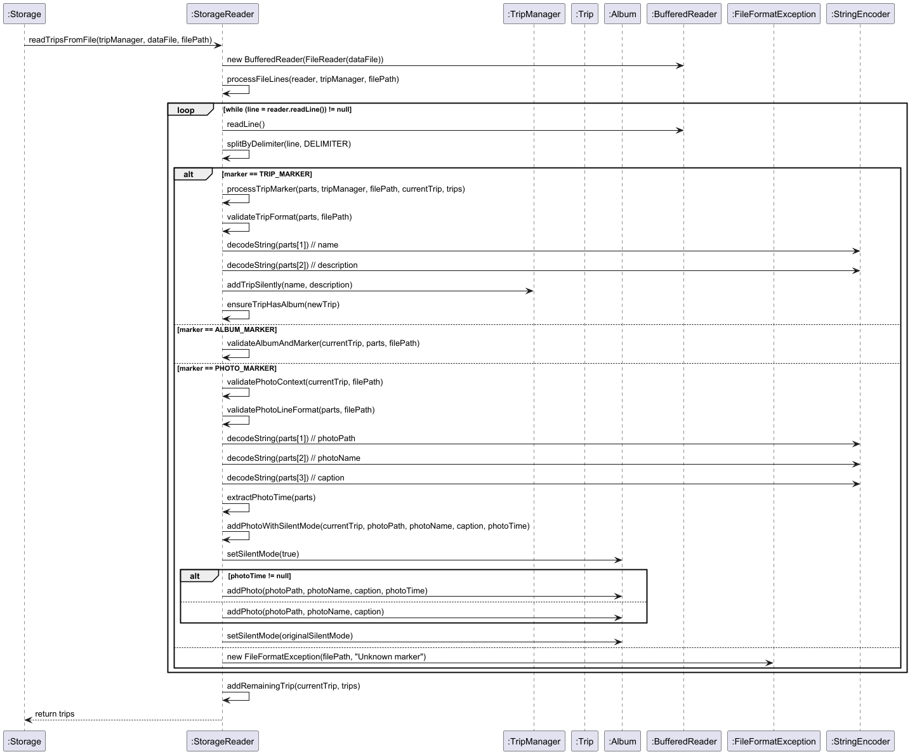
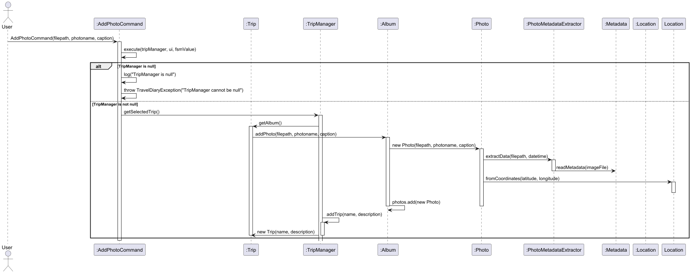

# Developer Guide

## Acknowledgements

## Product scope
### Target user profile

Roadtrippers, van lifers, backpackers, and long-distance drivers who want to document their journeys efficiently. These users value convenience, real-time tracking, and the ability to relive their trips through route history.

### Value proposition
The app enables roadtrippers to seamlessly track their journeys on the go. It automatically logs their geographical location, records mileage between stops, and helps them organize rest stops and key travel moments. By reducing manual input, it ensures that travelers can focus on their experience while still capturing essential trip details effortlessly.

## User Stories

| Version | As a ...      | I want to ...                                        | So that I can ...                                               |
|---------|---------------|------------------------------------------------------|------------------------------------------------------------------|
| v1.0    | new user      | see usage instructions                              | refer to them when I forget how to use the application          |
| v1.0    | user          | add a trip with a name and description              | record and organize my travel plans                             |
| v1.0    | user          | list all my trips                                   | view all the trips I’ve recorded                                |
| v1.0    | user          | select a trip                                       | manage the photos associated with that trip                     |
| v1.0    | user          | delete a trip                                       | remove trips I no longer want to keep                           |
| v1.0    | user          | add a photo with details                            | store visual memories along with meaningful captions            |
| v1.0    | user          | list all photos in a trip                           | review all my memories from a particular trip                   |
| v1.0    | user          | view details of a selected photo                    | see information like location, time, and caption                |
| v1.0    | user          | delete a photo from a trip                          | clean up photos I no longer want                                |
| v1.0    | user          | return to the main menu                             | navigate easily back to manage other trips                      |
| v2.0    | user          | get help on commands                                | learn how to use specific features                              |
| v1.0    | user          | exit the application                                | close the program when I'm done                                 |
| v2.0    | advanced user | access and edit the saved data file manually        | make bulk edits or backups directly from the storage file       |
| v2.0    | user          | get notified about missing fields when adding items | fix input errors immediately and avoid confusion                |

## Non-Functional Requirements

This application works on any computers that are Windows, macOS or Unix that has Java17.

## Glossary
* Trip - A user-defined journey or travel event that includes details such as start/end points, duration, and associated albums or photos.
* Album - A collection of photos linked to a specific trip, used to organize visual memories captured during the journey.
* Photo - An image file with metadata (e.g., caption, location, timestamp) that documents a specific moment within a trip.
* PhotoFrame - A graphical component responsible for rendering a photo and its metadata in a visually appealing layout.
* TripManager - A utility class or module responsible for creating and managing Trip objects during data loading and application runtime.

## Instructions for manual testing

{Give instructions on how to do a manual product testing e.g., how to load sample data to be used for testing}

## Design

# Architecture

## Architecture Diagram

The Architecture Diagram above explains the high-level design of the Travel Diary App.

Given below is a quick overview of main components and how they interact with each other.

## Main components of the architecture

**Main** (implemented in `TravelDiary` class) is in charge of the app launch and shut down.
* At app launch, it initializes the other components in the correct sequence and connects them with each other.
* At shut down, it saves data and invokes cleanup methods where necessary.

The bulk of the app's work is done by the following four components:

* **UI**: The UI of the App, implemented by `Ui` class.
* **Logic**: The command executor, implemented by `Command` classes and the `CommandFactory`.
* **Model**: Holds the data of the App in memory, primarily managed by `TripManager`.
* **Storage**: Reads data from, and writes data to the hard disk, implemented by the `Storage` class.

**Commons** represents a collection of classes used by multiple components, including exceptions and utility classes.

## How the architecture components interact with each other

### Component Interactions

The sequence diagram below shows a typical interaction flow when a user enters a command:

1. User enters a command through the **UI**
2. **Main** passes the command to the **Parser**
3. **Parser** processes the command and creates a command details map
4. **CommandFactory** creates the appropriate **Command** object
5. The **Command** is executed, potentially updating the **Model** (TripManager)
6. After command execution, any changes are saved via **Storage**
7. Results are displayed to the user through the **UI**

### State Management

The application uses a Finite State Machine (FSM) to track the user's current context:
* State 0: No trip selected
* State 1: Inside a specific trip

This state affects which commands are available and how they're processed.

## Component Details

### Main Component

The `TravelDiary` class:
* Initializes the UI, TripManager, and logging
* Loads existing trips from storage
* Processes user commands in a continuous loop until exit
* Saves all trips before exiting
* Manages the FSM state that tracks user context

### UI Component

The `Ui` class:
* Displays messages to the user
* Shows the current FSM state
* Presents welcome messages and command results
* Displays formatting elements like divider lines

### Logic Component

The Logic component consists of:
* **Parser**: Interprets user input into structured command details
* **CommandFactory**: Creates appropriate Command objects based on parsed input
* **Command** classes: Execute specific functionality and update the FSM state

Commands are executed based on the current FSM state, ensuring context-appropriate behavior.

#### Parser

####
- Contains static classes
- Parse input based on tags
- Return hashmap based on command name and tags

#### Parsing Input
The parsing process convert input and return hashmap which will be processed by CommandFactory.

The sequence diagram above illustrates how the `saveTasks` method processes a list of Trip objects:

1. The parsing will be split by space and tags
2. The return value for this parsing will be a hashmap <String, String>
3. The hashmap will be process to CommandFactory which will return the corresponding command

#### Command Sequence
The hashmap will be process based on its Command key value in the hashmap

The sequence diagram above illustrates how the `saveTasks` method processes a list of Trip objects:

1. The hashmap will always have a key `"command"`
2. The value of hashmap.get(`"command"`) will be the commandName eg. `"list"`
3. This value will be used to get the corresponding command eg. `ListCommand`

### Model Component

The `TripManager` class:
* Stores and manages all trips
* Maintains the current selected trip
* Provides methods to manipulate trips and their contents

#### Photo

####
- Stores image data with file paths and captions.

- Extracts metadata from image files using PhotoMetadataExtractor.

- Links each photo to a specific Location.

- Supports comparison of photos by datetime using PhotoDateTimeComparator.

- Can be displayed using PhotoPrinter.

### Storage Component

#### Overview
The **Storage** component is responsible for managing the persistence of application data, specifically trip details, photos, and albums. It facilitates saving data to a text-based file and loading it back into the application as needed. This component plays a critical role in ensuring the application's data remains intact across sessions.

#### Component Structure
The **Storage** component consists of several key classes that interact with each other to manage saving and loading data. Below is the class diagram for the **Storage** component.

#### Design Considerations

##### Data Format
The Storage component uses a text-based format with the following markers:
- `TRIP_MARKER ("T")`: Marks the beginning of trip data
- `PHOTO_MARKER ("P")`: Marks photo data
- `ALBUM_MARKER ("A")`: Marks album data
- `DELIMITER (" | ")`: Separates fields within a data entry

##### Exception Hierarchy
The component uses a specialized hierarchy of exceptions that provide specific information about issues:
- **FileReadException**: For issues reading the data file
- **FileWriteException**: For problems writing to the file
- **FileFormatException**: For invalid file format
- **TripLoadException**: For problems loading a specific **Trip**
- **PhotoLoadException**: For issues loading a specific **Photo**
- **PhotoSaveException**: For issues saving a **Photo**

### Commons

The Commons includes:
* **Exception classes**: Handle various error conditions (`InvalidIndexException`, `CommandNotRecogniseException`, etc.)
* **PhotoPrinter**: Manages photo display functionality
* **Logger**: Provides application-wide logging

### Design Considerations

### Persistence

The application saves data after each command to ensure data is not lost in case of unexpected termination.

### Error Handling

Robust exception handling ensures that:
* File-related errors are properly reported
* Command parsing errors are gracefully handled
* Invalid operations based on FSM state are prevented

### Extensibility

The architecture allows for easy extension:
* New commands can be added by implementing the Command interface
* Additional storage formats can be supported by extending the Storage component
* The FSM can be expanded to support more complex workflows

## Implementation

### Storage Component
The **Storage** component is implemented as a utility class with static methods for interacting with persistent storage. It employs the custom text file format described in the design section.

#### Key Operations

##### Saving Data
The saving process involves converting in-memory objects into a textual representation and writing them to a file. The `saveTasks` method is responsible for managing this process.

The **sequence diagram** below illustrates how the `saveTasks` method handles saving data for a list of **Trip** objects:

The process follows these steps:
1. Each **Trip** is serialized into a string line prefixed with the "T" marker.
2. If a **Trip** contains an **Album**, the album is serialized with the "A" marker.
3. For each **Photo** in the **Album**, the photo's details are serialized with the "P" marker.
4. The formatted data is written to the output file.

##### Loading Data
The loading process reads the text-based storage file line by line, reconstructing the corresponding in-memory objects. The `loadTrips` method is responsible for this operation.

The **sequence diagram** below shows how the `loadTrips` method processes the data:

The process follows these steps:
1. The file is read line by line.
2. Each line is analyzed by its marker (T, A, or P) to determine its type.
3. For **Trip** lines (T), a new **Trip** object is created via **TripManager**.
4. For **Album** lines (A), the **Album** is assigned to the current **Trip**.
5. For **Photo** lines (P), a new **Photo** object is created and added to the associated **Album**.
6. Errors are handled by throwing appropriate exceptions.

#### Special Handling

##### Encoding and Decoding
The **Storage** component ensures that special characters which could interfere with the file format are correctly encoded and decoded during the read and write operations:

- The pipe character (`|`) is encoded as `\pipe`
- Newline characters are encoded as `\newline`

This encoding guarantees that special characters in the data do not disrupt the file format.

##### Error Management
The exception handling system addresses various error scenarios during file operations:
- Provides specific error messages with context
- Includes the location of the failure
- Details the type of issue encountered to facilitate troubleshooting

### Add Photo Process Sequence Diagram

####

- AddPhotoCommand calls execute(tripManager, ui, fsmValue).

- TripManager getSelectedTrip() retrieves the current trip and its album.

- Album addPhoto(filepath, photoname, caption) creates a new Photo.

- Photo#extractData(filepath, datetime) extracts metadata.

- If metadata includes coordinates, a Location object is created.

- The photo is added to the album's list.

